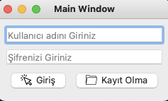
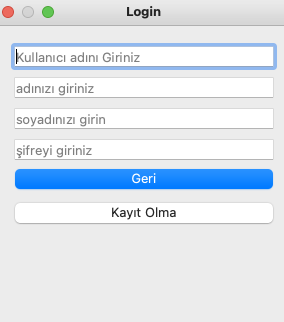
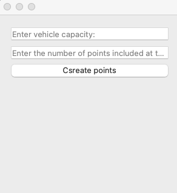
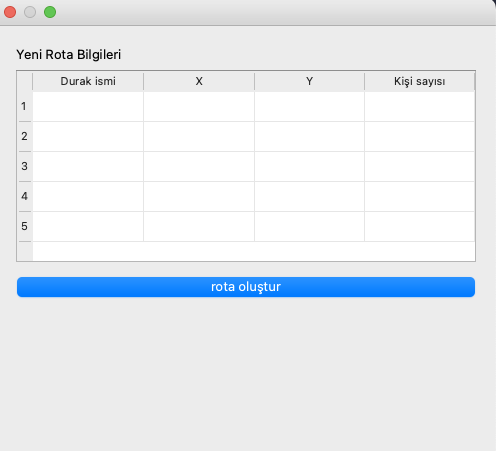

# Project Description
Gui system that routes vehicles based on the number of people at stops and distance. the system uses google maps api and google OR api to determine routes based on distances and capacity.

<figure>

</figure>

The interface has 4 screens. the first screen is the screen where we log in or register as a user. the information is saved to mssql.

##### Sing up Screen
<figure>

</figure>

#####  Selection screen
<figure>

</figure>

#####  Third  screen
<figure>

</figure>

in the following screen we enter the coordinates of the points, the name and the number of people waiting at the stop

<figure>

</figure>

the results are written to the 'results.xlsx' file.